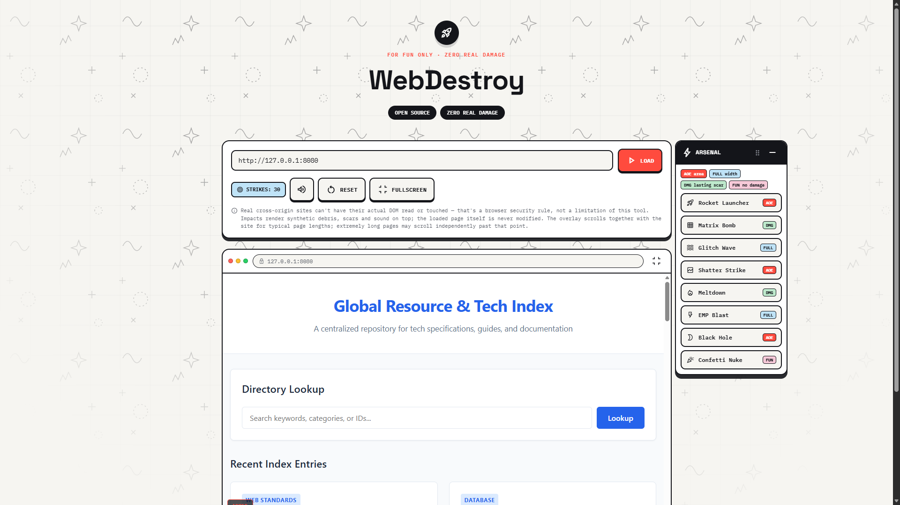
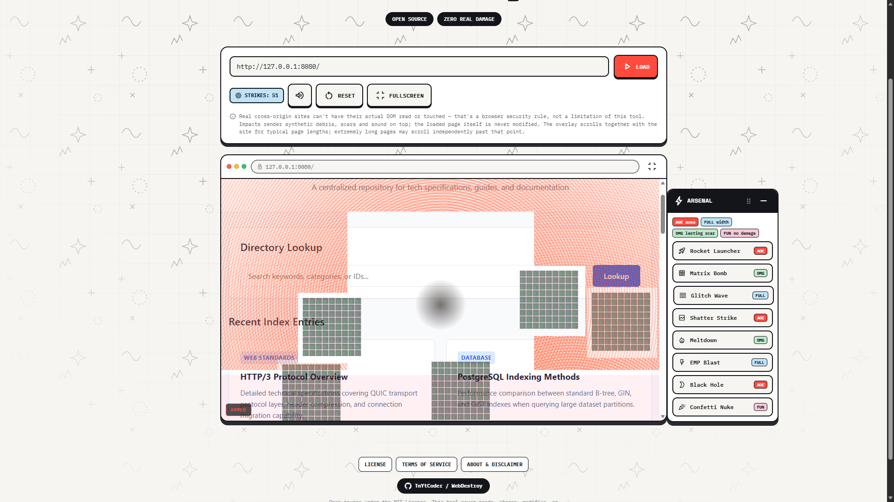

# 💥 WebDestroy

> *A fun, harmless web page overlay that simulates total website destruction to prank your friends!*

Ever wanted to make your friends panic for a second thinking you just hacked or wiped out a web page? **WebDestroy** is a purely visual, client-side prank tool that triggers dramatic "destruction" animations and "hacking" visual effects—**without causing any actual harm or modifying real data.**

---

## 📸 Screenshots

Check out **WebDestroy** in action:

| Visual Effect Preview | Terminal / Prank Mode |
| :---: | :---: |
|  |  |


---

## ✨ Features

- **🎭 Harmless Prank:** 100% cosmetic visual effects. No actual web servers, databases, or files are harmed!
- **⚡ Single File Simplicity:** Built entirely inside `WebDestroy.html`—no servers, dependencies, or backend setups required.
- **💻 Authentic Look:** Features intense visual glitches, fake terminal output, and "destruction" overlays to make the prank convincing.
- **📱 Fully Responsive:** Works smoothly across both desktop browsers and mobile screens.

---

## 🚀 Quick Setup & Usage

Getting started takes less than 10 seconds:

1. **Clone the repository:**
   ```bash
   git clone [https://github.com/TnYtCoder/WebDestroy.git](https://github.com/TnYtCoder/WebDestroy.git)


2. **Open the file:**
Navigate into the project directory and open `WebDestroy.html` in any modern browser:
* Double-click `WebDestroy.html`, **OR**
* Drag and drop `WebDestroy.html` straight into your browser window.


3. **Prank your friends!**
Load it up on a target browser or screen and watch the fake panic unfold.

---

## 📂 Project Structure

```text
WebDestroy/
├── WebDestroy.html       # Main standalone prank page
├── screenshots/          # Preview images & screenshots
└── README.md             # Project documentation

```

---

## ⭐ Support & Community Growth

If this project made you chuckle or helped you pull off a fun prank on your friends, **please consider dropping a Star (⭐) on this repository!**

As a developer growing my portfolio, every star and share means the world to me and helps more people discover my projects.

---

## 👨‍💻 Developer / Author

Crafted with ❤️ by **[TnYtCoder](https://github.com/TnYtCoder)**

---

## ⚠️ Disclaimer

*This tool is created strictly for entertainment, educational, and prank purposes among friends. It does not perform any malicious activities, exploit vulnerabilities, or store any sensitive information.*
